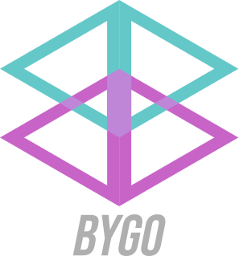

# BYGO - Before You Go

<div align="center">


</div>

BYGO is a linear algebra tools which available in compile time expressions written in C++. The main purpose of this library is reducing the runtime process as possible.

## Build and Install
Clone the repository at first.
```console
$ git clone https://github.com/koseng-lc/bygo.git
```
Prepare the build folder, and then install.
```console
$ cd bygo
$ mkdir build
$ cd build
$ cmake -DBYGO_INSTALL_PREFIX=/opt ..
$ make install -j2
```

## Linking
After the package successfully installed, determine the package parent folder, and then use the ```find_package``` feature.
```cmake
set(bygo_DIR _FILL_WITH_THE_PREFIX_PATH_)
find_package(bygo REQUIRED)
target_link_libraries(_YOUR_PROJECT_NAME_
    bygo_lib
)
```

## Example
```cpp
#include <bygo/bygo.hpp>

int main(int argc, char** argv){
    
    using ndarray_t = bygo::basic_elem<bygo::shape<3,2,4,2>>;

    ndarray_t arr{{
        {
            {{1,2},{3,4},{5,6},{7,8}},
            {{3,4},{1,2},{7,8},{5,6}}
        },
        {
            {{5,6},{1,2},{7,8},{3,4}},
            {{7,8},{3,4},{1,2},{5,6}}
        },
        {
            {{1,2},{5,6},{3,4},{7,8}},
            {{3,4},{1,2},{5,6},{7,8}}
        }
    }};

    bygo::util::print(arr);

    return 0;
}
```

## Author
Lintang Erlangga ([koseng-lc](https://github.com/koseng-lc))