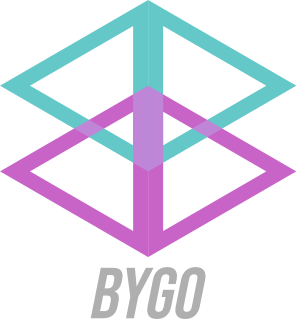

# BYGO - Before You Go


BYGO is a linear algebra tools which available in compile time expression written in C++. The main purpose of this library is reducing the runtime process as possible.

## Example
```cpp
#include <bygo/bygo.hpp>

int main(int argc, char** argv){
    using ndarray_t = bygo::basic_elem<bygo::shape<3,2,4,2>>;

    ndarray_t arr{{
        {
            {{1,2},{3,4},{5,6},{7,8}},
            {{3,4},{1,2},{7,8},{5,6}}
        },
        {
            {{5,6},{1,2},{7,8},{3,4}},
            {{7,8},{3,4},{1,2},{5,6}}
        },
        {
            {{1,2},{5,6},{3,4},{7,8}},
            {{3,4},{1,2},{5,6},{7,8}}
        }
    }};

    return 0;
}
```

## Author
Lintang Erlangga ([koseng-lc](https://github.com/koseng-lc))